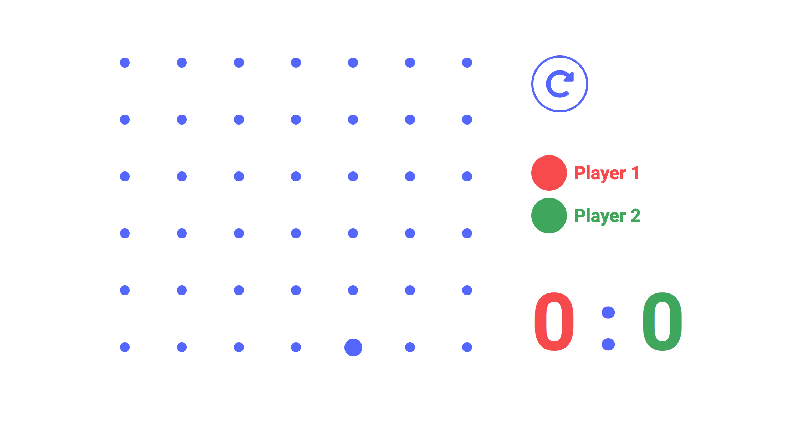
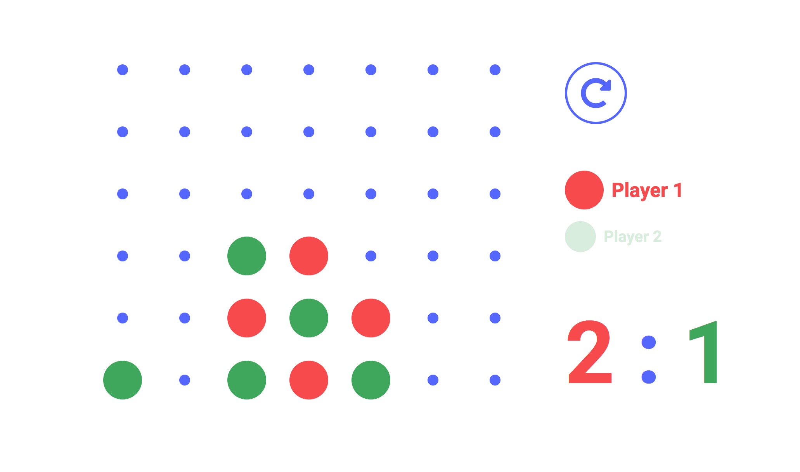
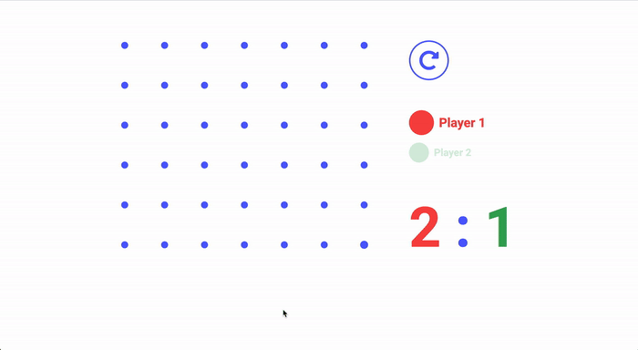
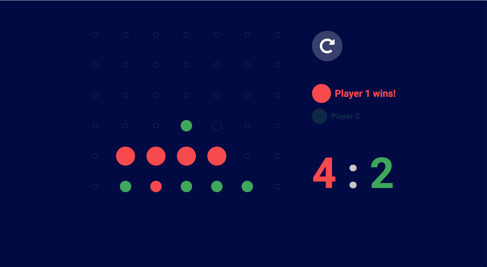

---

### Logic

The game logic was programmed in Javascript jQuery. There were a lot of challenging parts, for example, figuring out when somebody's won diagonally.

---

### Accessibility

With a strong focus on accessibility, the game is fully playable using the keyboard.

`left arrow key` - Move left

`right arrow key` -Move right

`Enter` - Make a move

`R` - Reset the board

`N` - Toggle dark mode

---

### Animations

The game features subtle and intuitive CSS animations that take the experience to another level. It was extremely rewarding seeing it come together in the end.

---

### Dark Mode

A dark mode is available upon pressing `N`. The settings are being stored in local storage.

---
