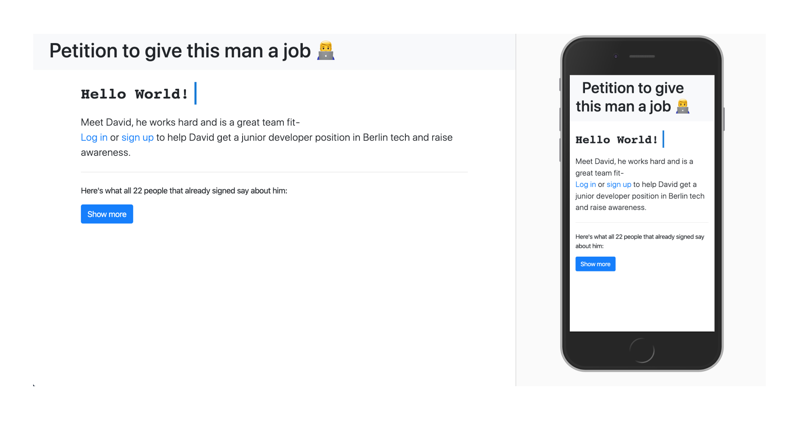
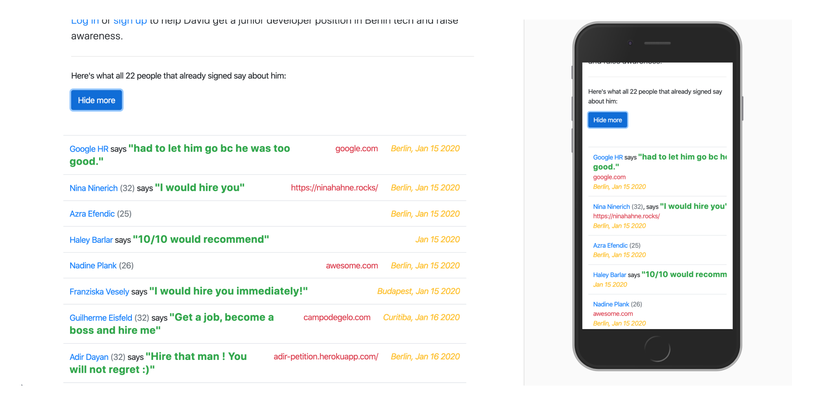
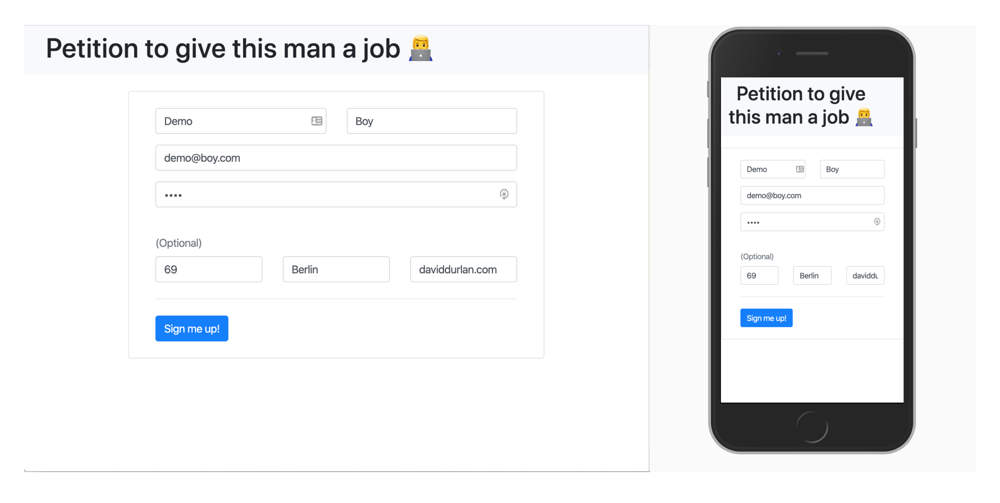
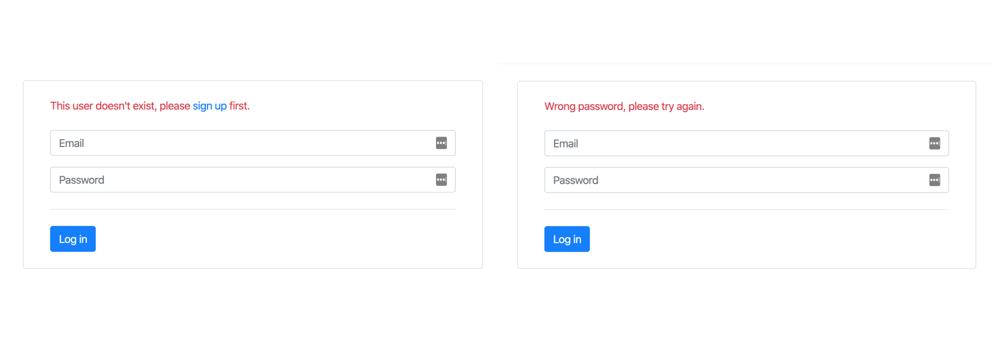
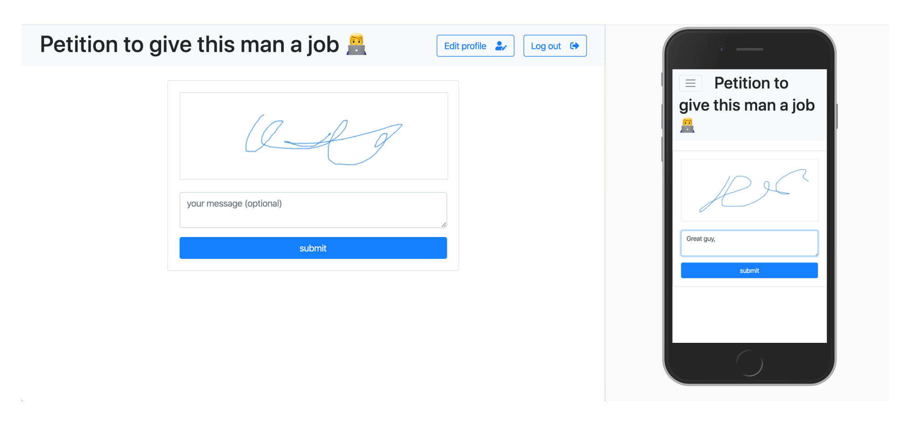
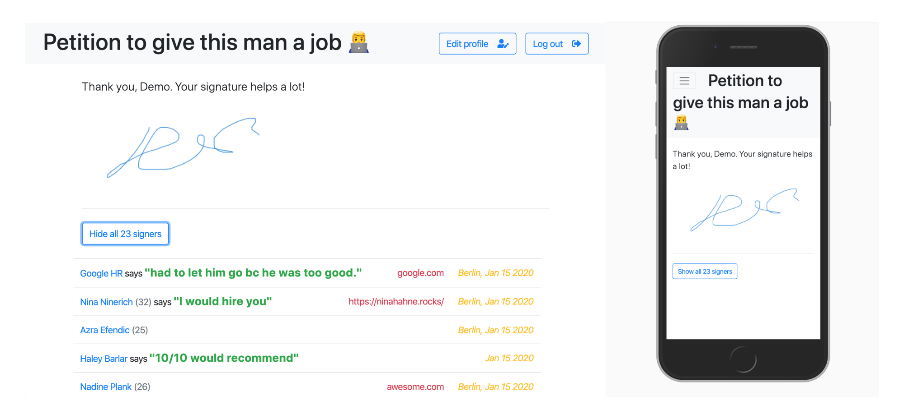
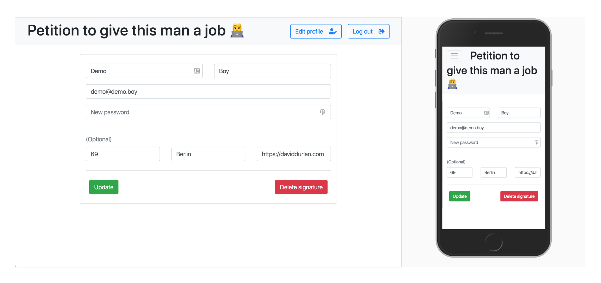

Hire me! This project marked the time where I was introduced to a more complex data flow and the dynamics of working with Node and SQL extensively.

---

###Backend

In the back a Node.js Express Server and a PostgreSQL database CRUDfully take care of things like storing user information and authentication. The platform is protected from potential SQL injections and CSURF attacks. When a user signs, rather than storing an image, the raw data string is stored. This helps reduce file size and later, when displaying the signature again, it makes sure there are no pixelated signatures. Express-Handlebars is used to render different HTML templates.

---

### See who already signed

View other signers name, age, city, message, and website. You can also sort by city when including `/berlin` etc. in the URL.

---

###Authentication

Authentication is accomplished using Node.js, Bcrypt and cookies.

If something went wrong, an error message will alert the user.

---

### Sign the petition

Provide a signature by drawing into the HTML `<canvas>` element. Touchevents have been set up to make signing possible on mobile as well. The logic was written in JavaScript jQuery.

After successfully signing, the user is shown his signature as well as a list of everybody else who signed.

---

### Edit your profile, delete your signature

---

### Frontend

Using Handlebars, information from the server is being displayed. Attempting to learn a new skill, these pages were entirely styled mobile first with Bootstrap 4.

---
