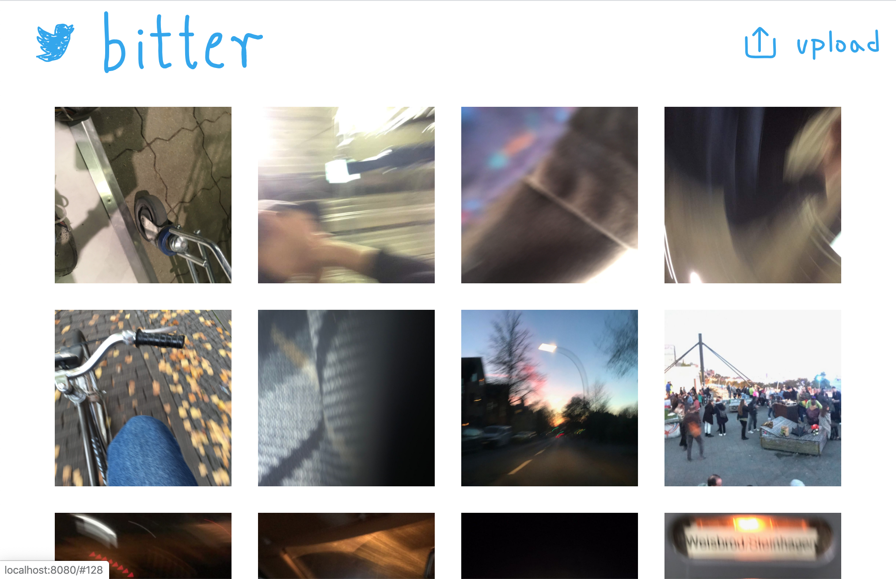
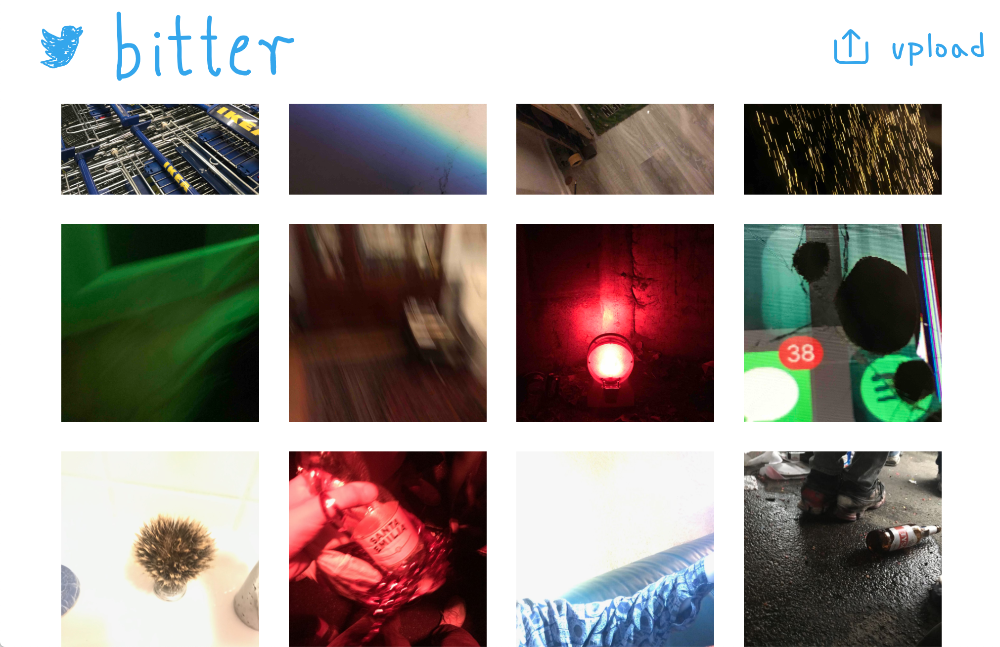
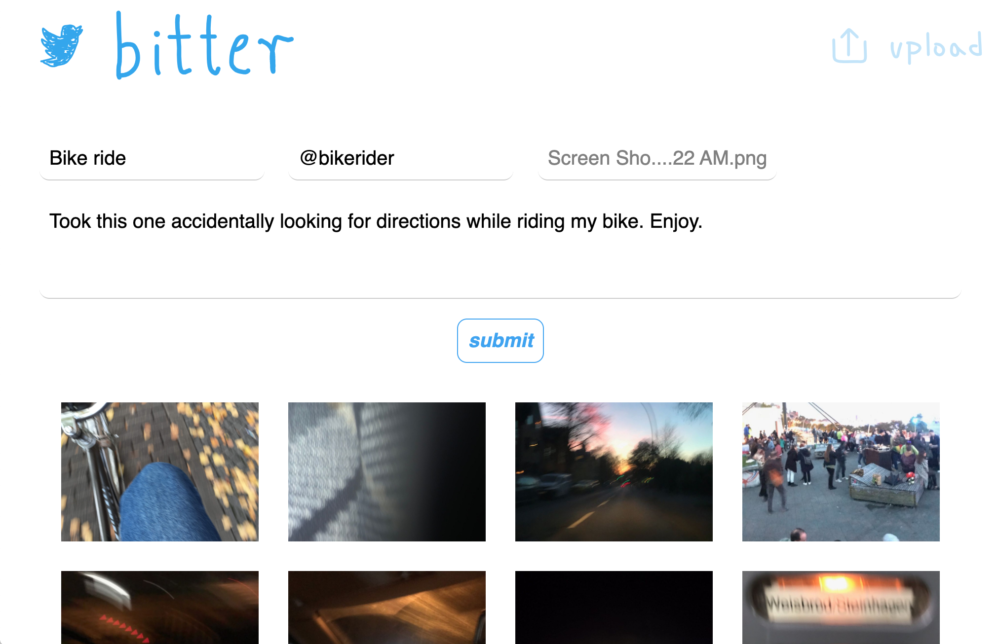
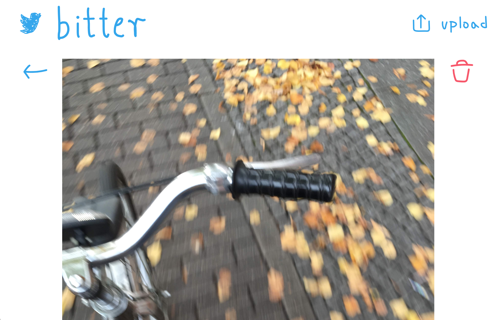
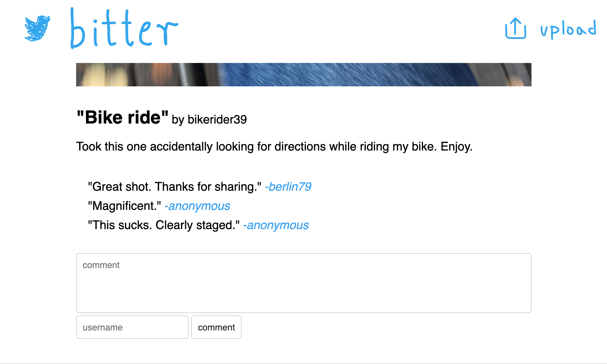

First time using Vue.js! This project came to life when I realized the world was in need of more blurry, shaky, accidentally captured b-roll images. Everybody has the permission to upload or delete any picture, that guarantees there are no bad pictures on the site. The comment section underneath a picture opens a space for discussions and feedback. My plans for the future are to come up with a better branding and to deploy this.

---

### Backend

In the back, a Node.js Express server and a PostgreSQL database CRUDfully make sure everything is kept alive.

The image board displayes the 20 most recent pictures, upon scrolling down more images are being loaded and displayed

---

### Upload

New images get grabbed using Multer, then uploaded to AWS S3, with a reference stored in the database.

---

### Interaction

Visit a posts page, to get a better look.

Interact with the author, ask questions, critique, praise, or simply share your thoughts in the comment section.

---

### Frontend

In the front, Vue.js works its magic.

I wanted the design to be kinda shitty so all icons are carelessly hand drawn with a trackpad.

Navigation to different pages is provided with Hash-Routing, so that posts can be sent to other places on the internet.

---
