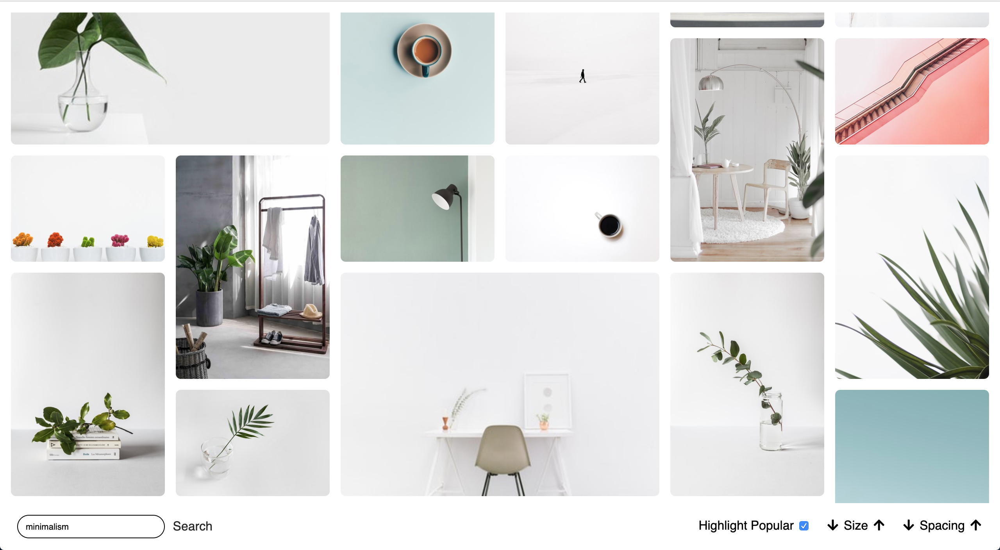
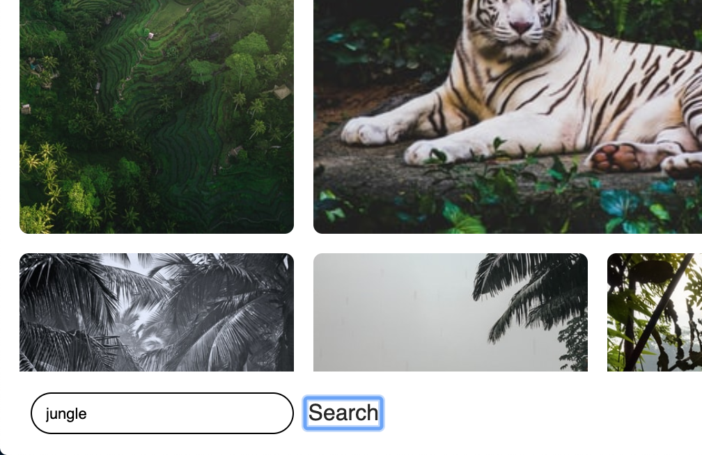
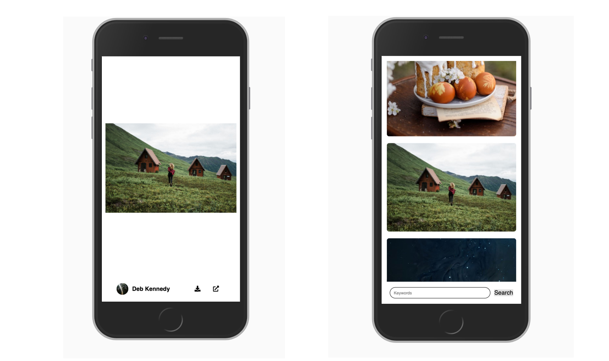

The webpage fetches images from the unsplash api and displays them in a grid. Users can browse, search for topics, and control display settings.

---

###Browse pictures from the unsplash api in a responsive, multi size grid

The key player here is the `grid-auto-flow: dense` property and setting `object-fit: cover`. Here's a tutorial explaining the `dense` property in more detail: [css-tricks.com/the-auto-flowing-powers-of-grids-dense-keyword/](https://css-tricks.com/the-auto-flowing-powers-of-grids-dense-keyword/)

### Search for topics

A `GET` Request to the unsplash api using the input value is made.

###Customize the grid

Using root variables in the style sheet, values for grid rows, columns and gap sizes can be changed dynamically. Or toggle a `big` class on the most popular 10% of images!

---

###Browse it on mobile

Designed mobile first, this page does very well on all view sizes. One CSS breakpoint at `415px` is used to transition from mobile to desktop.

---

### Browse by keyboard

Use the `tab`, `Shift + Tab`, `Space`, and `Enter` keys to navigate all parts of the page without hassle. Furthermore, all UI elements are high in contrast and easy to read.

---

###Scroll infinitely

Upon scrolling to the bottom, the page will automatically load more images. Currently, the unsplash api allows for 50 requests per hour.

---

### See error information

Get a display of the error message if something went wrong, while images are loading or your search didn't return any results.

---

## The biggest struggle?

Even though a library could've gotten me much better results, I'm pretty happy with the CSS grid I made. However, there is no way to keep the images fully uncropped, without having to do some heavy calculations and translations.

---

## The biggest success?

The search functionality 😋 It's so satisfying to browse topics that come to mind and scroll through beautiful images. If I had more time, I'd implement a feature to create collections and moodboards to save the favorite images you come across 🤗

---
