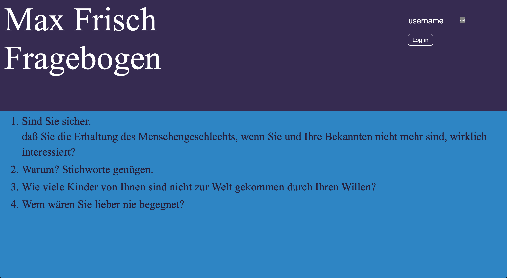
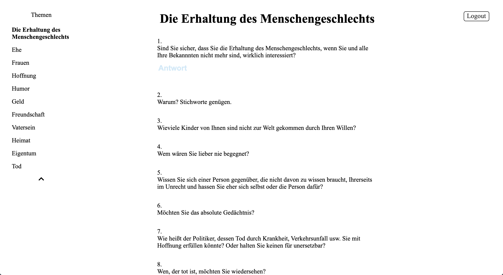
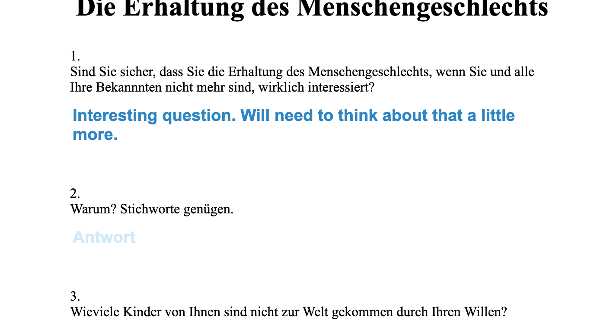
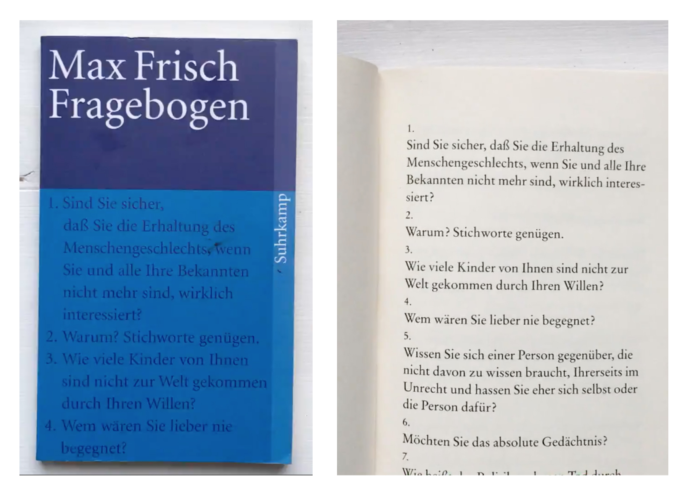

This is a response to when I was reading the book, but didn't want to have to carry around a pencil and paper at all times to answer the questions. In transforming it into a web site, users can not only answer the questions a lot more efficiently, but could potentially create a completely different set of answers in different periods of time and go back, seeing how they answered it for example a year ago versus now.

---

### Backend

With a Node Express server up and running, user information gets handled. Instead of a database, user information gets stored and accessed trough server side JSON files, utilizing Node's core file system module.

Users can browse different chapters and questions.

---

### Frontend

Strict translation of the cover, text and overall layout of the original book with CSS.

---

###Original book

---
